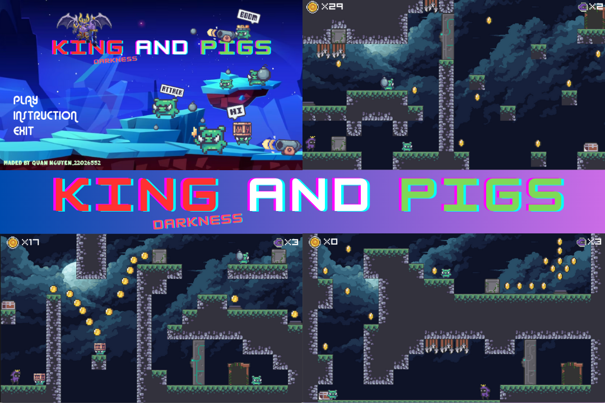
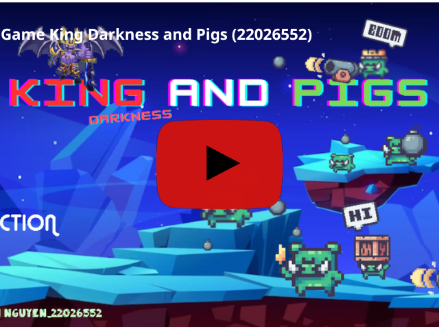

# KINGS DARKNESS AND PIGS

## Giới thiệu
- Chào mọi người mình là **Nguyễn Văn Quân (22026552)** sinh viên K67 trường **Đại học Công Nghệ**, đây là dự án đầu tiên của mình nên vẫn còn nhiều thiếu sót mong mọi người góp ý và ủng hộ để các bản update sau được hoàn chỉnh hơn.

## Cốt truyện
- King Darkness and Pigs là 1 tựa game lấy ý tưởng từ trò chơi ***Celeste***, một trò chơi có thể loại platformer (trò chơi đánh nhau và di chuyển trên nền tảng) được phát triển và xuất bản bởi Maddy Makes Games vào năm 2018.

- Cốt chuyện của King Darkness and Pigs xoay quanh nhanh vật chính là chúa tể bóng tối **Maloch** sau 1 lần đi chơi với công chúa **Peony** đã không may để bọn lợn xanh chiếm mất lâu đài, game là 1 hành trình của vua maloch đấu tranh đánh bại kẻ thù để dành lại ngôi vị của mình

## Cài đặt và cách chơi
Các bạn có thể cài đặt game theo video hướng dẫn của mình:
>- Các bạn có thể tải source của mình và chạy trên trình biên dịch codeblock ( chú ý cài thư viện SDL2 cho codeblock)
>- Dưới đây là video hướng dẫn:

>Mình đã để sẵn mục SDL trong source nên các bản khi cài SDL cho codeblock có thể dẫn tới luôn thư mục chứa các thư viện SDL2 đó

## Update sắp tới
- Menu thêm phần tùy trỉnh âm thanh
- Thêm các kĩ năng mới cho nhân vật
- Làm thanh máu cho nhân vật
- Update thêm 1 số quái và các vật phẩm sau khi tiêu diệt quái
- Update thêm các map mới có độ khó cao hơn

## Đóng góp

- Nếu bạn muốn đóng góp cho game, vui lòng truy cập trang GitHub của mình và tạo một pull request. Mình rất hoan nghênh mọi đóng góp từ cộng đồng.

## Liên hệ 

- Nếu bạn có bất kỳ câu hỏi hoặc góp ý nào, vui lòng liên hệ với mình qua email ***quanlh3052004@gmail.com*** . Mình rất vui lòng được trò chuyện với bạn.

## Tham khảo
- Page LazyFoo: [Lazyfoo](https://lazyfoo.net/tutorials/SDL/)
- Youtuber: [Madsycode](https://www.youtube.com/@Madsycode/playlists)
- Youtuber: [Phát Triển Phần Mềm 123A-Z](https://www.youtube.com/@PhatTrienPhanMem123AZ)
- Geeksforgeeks.org
- Stackoverflow.com

## Lời kết
- Tuy chưa có nhiều kinh nghiệm trong việc thiết kế game, song mình vẫn đầu tư tâm huyết và trí lực của mình vào việc hoàn thiện thiết kế để mọi người có được trải nghiệm tuyệt vời nhất, cảm ơn mọi người đã dành thời gian quý bấu dụng sản phẩm! 